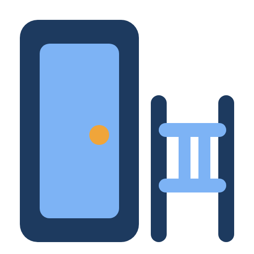
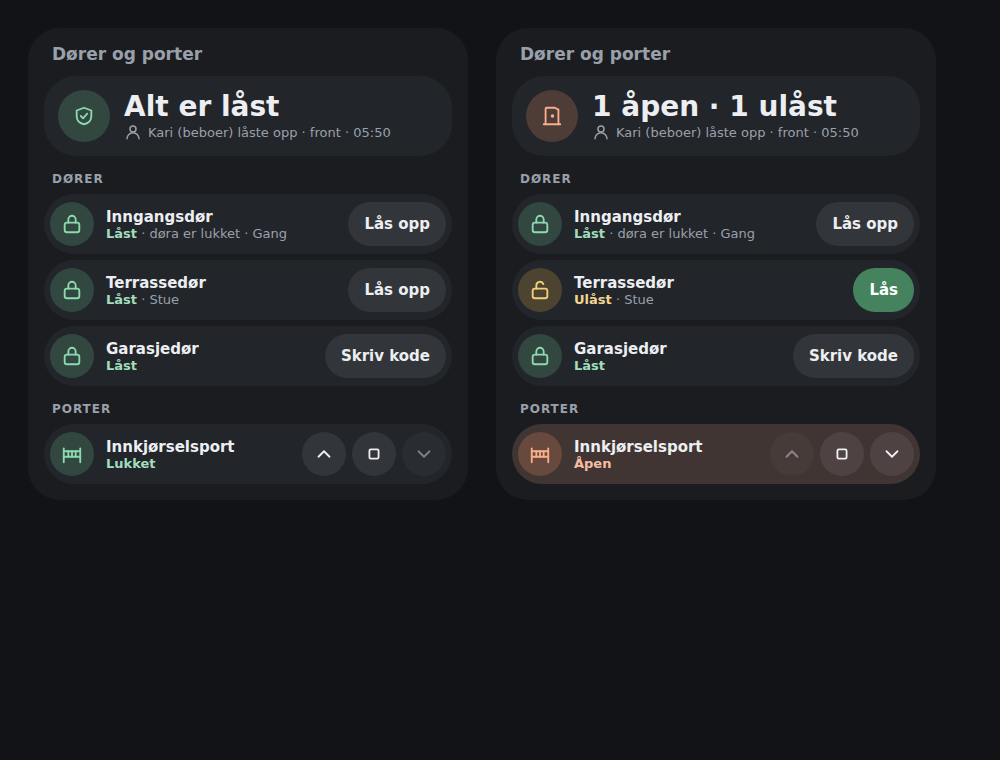
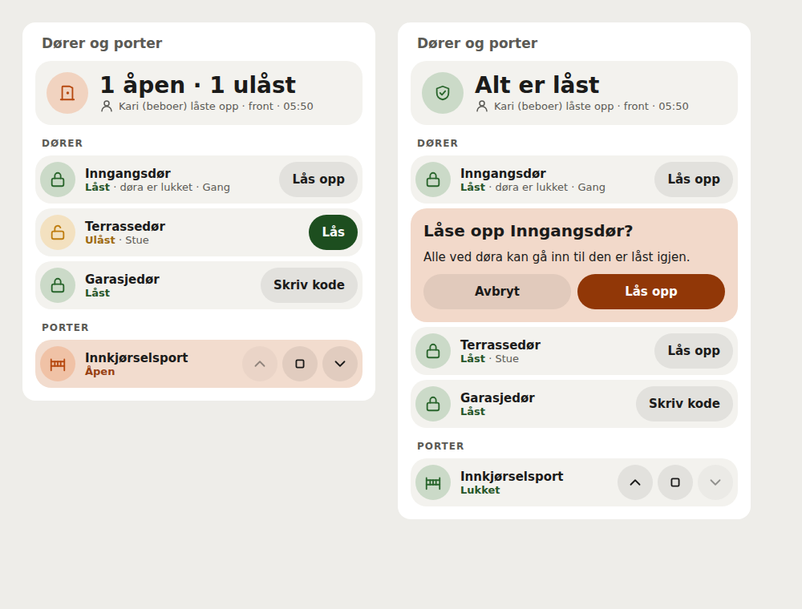

# Access Control card

A Lovelace card that gathers the house's doors and gates in one place: whether
everything is locked, what is open, who last used the door panel, and the
everyday actions — lock, unlock, open and close the gate. English and Norwegian
Bokmål (*Dører og porter*).





The images use the production bundle with simulated Home Assistant states. No
live Home Assistant instance was involved.

## Install

In HACS, open **Custom repositories**, add
`https://github.com/mvheimburg/lovelace-access-control` as a **Dashboard**
repository and install **Access Control Card**. HACS normally adds the resource;
if not, add `/hacsfiles/lovelace-access-control/access-control-card.js` as a
JavaScript module under **Settings → Dashboards → Resources**.

The card works with Home Assistant's own `lock` and `cover` entities, from any
integration (KNX, MQTT, Z-Wave …). It needs no integration of its own.

## Card

```yaml
type: custom:access-control-card
title: Dører og porter
appearance: bubble
doors:
  - lock.front_door
  - lock.terrace
  - entity: lock.garage_door
    name: Garasjedør
    contact: binary_sensor.garage_door_contact
gates:
  - cover.driveway_gate
access_event: event.doorbell_door_access
confirm_unlock: true
confirm_gate: true
```

| Option | Default | Description |
| --- | --- | --- |
| `doors` | all `lock` entities | Door locks. An entry is an entity ID, or an object with `entity` and optionally `name` and `contact`. |
| `gates` | all gate/garage `cover` entities | Gates. Same form as `doors`. |
| `access_event` | none | An `event` entity whose events carry `event_type` (`unlock`, `lock`, `open`, `close`), `user_name`, `access_level` and `door`, such as the door panel's `event.doorbell_door_access`. Shown as the last panel event. |
| `confirm_unlock` | `true` | Ask in the card before unlocking a door. |
| `confirm_gate` | `true` | Ask in the card before opening a gate. |
| `title` | Doors and gates / Dører og porter | Heading. |
| `appearance` | `default` | `default` or `bubble` (uses the dashboard's `--bubble-*` variables). |

The visual editor lists the house's locks and gate covers as checkboxes, the
event entities for `access_event`, and the confirmation and appearance choices.
Entries written as objects in YAML are kept when you tick or untick others.

## What it shows

- **Status first.** *All locked*, or what needs attention, most urgent first:
  jammed locks, doors or gates not responding, open doors and gates, unlocked
  doors — for example *1 open · 1 unlocked*. Below it, the last event from the
  door panel: *Kari (resident) unlocked · front · 14:03*.
- **Doors and gates as two groups.** Each row shows the state, whether the door
  itself stands open, and the area. A door contact is found automatically when
  the lock's device has exactly one door/opening sensor; set `contact` to choose
  one yourself. Tap a name for Home Assistant's own dialog.
- **Actions.** A locked door offers **Unlock**, an unlocked one **Lock**; a gate
  has arrow buttons — up to open, stop (when the gate supports it) and down to
  close — with the direction it is already at disabled (0.2.0). Unlocking and opening a gate are confirmed inside the card unless turned
  off. A lock that needs a code offers **Enter code**, which opens Home
  Assistant's dialog so the code is entered there. With two or more unlocked
  doors, **Lock all** locks them in one call.
- **Feedback.** A request in flight shows *Sending…* and blocks a second press;
  a failure is shown by the door it concerns, and the row keeps showing Home
  Assistant's real state. A door or gate that is not responding has its actions
  disabled.

## Language and formatting

The card follows Home Assistant's language (`nb`, `nb-NO` and `no` give Bokmål;
`nn` uses Bokmål too; anything else English) and updates when it changes. Times
use Home Assistant's formatting locale and 12/24-hour preference separately.
Entity and user names are shown as Home Assistant and the panel name them. The
card-picker entry is English because it has no Home Assistant context.

## Development

```sh
npm ci
npx playwright install chromium
npm test
npm run lint
npm run typecheck
npm run build
node scripts/screenshot.cjs
```

`dist/` is committed and must match the build. Pushing a new `package.json`
version to `main` tags `v<version>` and publishes a release.

## License

MIT
